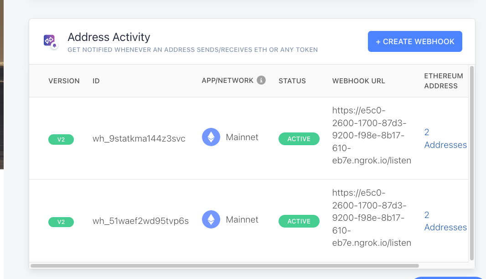

This application let you register a webhook for account activities you wanted to listen to on Ethereum and other networks using Alchemy sdk. 

The app requires you to register on alchemy and get an auth token. For this demo I created a dummy free account for you to use w/o setting up an alchemy account. You can change the auth token and network on app.properties file.

# alchemy
https://docs.alchemy.com/reference/sdk-create-webhook 

Steps to run the project: 
Clone the project using git to your local director. 
cd to the main dir.

npm install express

npm i body-parser

npm install alchemy-sdk

npm i properties-reader

In order to have the request come to your localhost, you can use ngrok https://dashboard.ngrok.com/get-started/setup but you can also see the requests on https://webhook.site/. Make sure your ngrok is running locally before making requests. 

Make sure to validate your webhook works before registering it.

Finally run your application

ts-node index.ts

Once you run your application make POST request to
<app server dir>/register/hook'

Use the following json format

{"address":
["0xe592427a0aece92de3edee1f18e0157c05861564", "0xc2aaCf6553D20d1e9d78E365AAba8032af9c85b0", "0xe592427a0aece92de3edee1f18e0157c05861564"],
"webhook":"https://e5c0-2600-1700-87d3-9200-f98e-8b17-610-eb7e.ngrok.io/listen"}

if successful, within few seconds your webhook should receive calls at <app server dir>/listen

#What I would change
1) The API isn't secure and can take any incoming request through the port. So I would secure the API.

2) I would do validations on wether the contract addresses being submitted are ethereum contracts. Alchemy does it for us already but we can add another layer of protection.
3) I would also test wether the webhook we are registering works.
The same way you can do it from Alchemy UI.
4) Deploy the application on the cloud that is scalable and can handle many incoming requests.
5) Make a generic API gateway that can register any webhooks but depending on the request we can delegate it to other methods. That way we don't create many gateways(i.e more REST APIs to secure) for attacks.